<p align="center">
  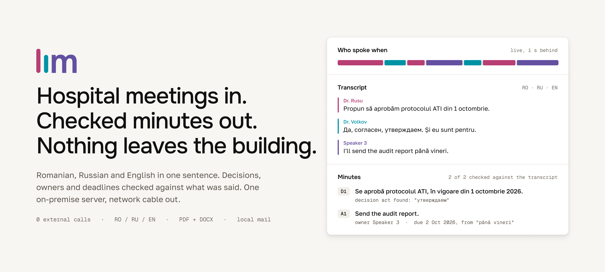
</p>

# Liminal

**Minutes a hospital can send without editing, from a meeting that switches
between Romanian, Russian and English mid-sentence, on a server that never
touches the internet.**

Upload a recording or press Record, and pick the meeting type (Liminal
suggests one). A few minutes later every attendee has the minutes in Romanian,
Russian and English, as PDF and DOCX: the decisions, and every action item with
its owner and a real calendar deadline. Every one of those facts was checked by
code against the words that were actually said.

Built for Medpark International Hospital at DeepTech GigaHack 2026, Chișinău.

<p align="center">
  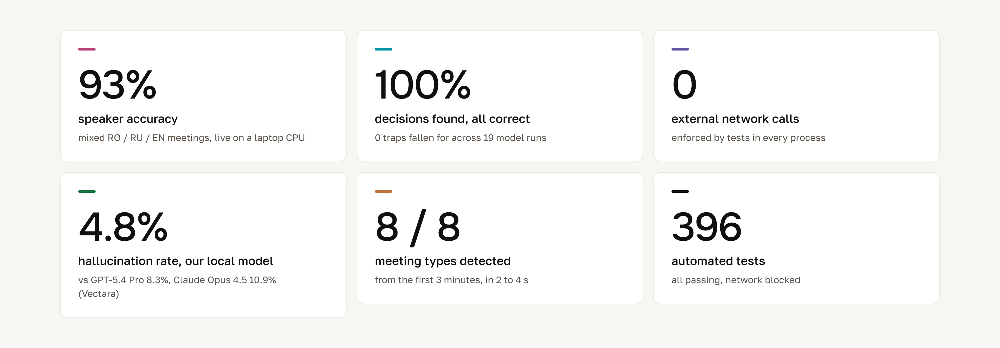
</p>

## Why a hospital needs this, and why the cloud tools fail it

In 2023 attackers sat inside PJ&A, a US medical transcription vendor, for five
weeks and took the records of
[8.95 million patients](https://www.bleepingcomputer.com/news/security/pj-and-a-says-cyberattack-exposed-data-of-nearly-9-million-patients/),
[3.9 million of them from Northwell Health](https://www.hipaajournal.com/northwell-health-pja-data-breach/),
New York's largest health system. The hospitals did nothing wrong except send
their audio to someone else. A healthcare breach now costs
[$7.42 million on average](https://www.hipaajournal.com/average-cost-of-a-healthcare-data-breach-2025/),
the most of any industry for 14 years running.

The meeting tools a hospital could buy all send audio to a cloud, and most of
them cannot follow a Moldovan meeting anyway:

| | Romanian | Romanian and Russian in one meeting | Runs inside the hospital | Price |
|---|---|---|---|---|
| Otter.ai Business | [no](https://help.otter.ai/hc/en-us/articles/360047247414-Supported-languages) | no | no | $19.99 per user per month |
| Microsoft Teams Premium recap | [no](https://support.microsoft.com/en-us/teams/meetings/recap-in-microsoft-teams) | no | no | Premium licence per user |
| Deepgram Nova-3, code-switching mode | [no](https://developers.deepgram.com/docs/models-languages-overview) (10 languages, Russian yes, Romanian no) | no | no | per minute |
| Fireflies.ai Business | yes | multi-language mode, beta | no | $19 per seat per month, plus credits |
| ElevenLabs Scribe + pyannoteAI | yes | automatic detection | no | $0.40 + €0.10 per hour of audio |
| **Liminal** | **yes** | **yes, per utterance and per phrase** | **yes, with the network cable out** | **one server the hospital already owns** |

Under the challenge's rules every cloud row is disqualified before scoring
starts. Liminal passes that gate by construction: no part of it can open a
connection to anything outside the machine, and tests fail the build if one
tries.

## The business case

**Who it is for.** Medpark is Moldova's first and largest private
multidisciplinary hospital: 200+ doctors, 160,000+ patients a year, and level 6
of 7 on the HIMSS digital-maturity scale
([Medpark via Bupa](https://www.bupaglobal.com/en/facilities/1001918/medpark-international),
[NewsMaker](https://newsmaker.md/ro/comunitatea-tech-a-testat-aplica%C8%9Bia-medpark-%C3%AEn-cadrul-deeptech-gigahack-2026)).
Its medical, executive and administrative boards meet regularly, and each
meeting's decisions are only as good as the minutes that carry them to the
people who must act.

**Where the value comes from.**

| Driver | Today | With Liminal |
|---|---|---|
| Writing the minutes | someone listens again and types for an hour or more | drafted, checked and sent within minutes of the meeting ending |
| Decisions reaching owners | days later, or never | the same day, each action with a named owner and a date |
| Language | the writer translates in their head between RO and RU | the same minutes in Romanian, Russian and English |
| Data risk | a cloud note-taker makes a vendor a processor of patient-adjacent data | no third party ever holds the audio or text |
| Cost | per seat, per month, forever | one server the hospital already runs |

**Time returned, with the assumptions on the table.** We have not measured
Medpark's own meetings, so these are assumptions to replace with its numbers:

| Board meetings a week | Hours to write one set of minutes | Hours returned a year | Full-time staff equivalent (1,700 h) |
|---|---|---|---|
| 10 (low) | 1.0 | 520 | 0.3 |
| 25 (base) | 1.5 | 1,950 | 1.1 |
| 50 (high) | 2.0 | 5,200 | 3.1 |

<p align="center">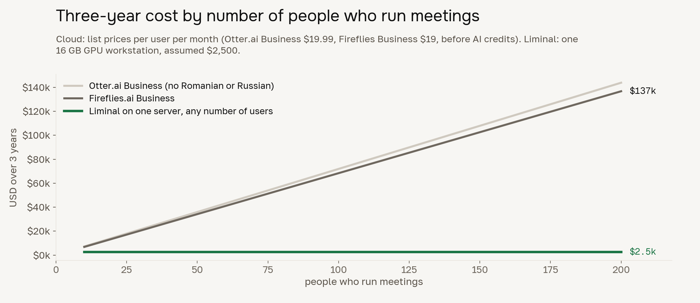</p>

**Risk avoided.** A healthcare data breach costs
[$7.42 million on average](https://www.hipaajournal.com/average-cost-of-a-healthcare-data-breach-2025/),
and the PJ&A case shows how: the hospitals were breached through their
transcription vendor. Liminal has no vendor in the data path.

**How we would roll it out, and what we would measure.**

| Step | Scope | Success measure |
|---|---|---|
| Week 1 | IT installs one compose stack; one medical board, a table microphone | minutes emailed under 15 min after the meeting |
| Weeks 2 to 4 | the same board every week | items a person had to change per meeting falls week on week; zero patient names in any email |
| Month 2 | executive and administrative boards | share of meetings that go out with no edits |
| Month 3 | every board; Active Directory sign-in; the hospital's mail relay | adoption: share of board meetings processed |

**What could go wrong, and the answer.**

| Risk | Answer |
|---|---|
| A far microphone lowers speaker accuracy (66.5% on AMI) | a table microphone near the speakers puts meetings in the 93% range; the room check picks settings by itself |
| The model gets an item wrong | code checks every fact; anything unproven waits for a person; the 60 s window lets anyone stop the email |
| People do not adopt it | three steps, no training, the type suggested for them; the minutes arrive in the reader's language |
| IT burden | one Docker Compose stack, a status page, no internet dependency to break |
| Compliance | DPIA draft, AI Act marking, consent for voiceprints, retention purge (see [Medical and legal context](#5-medical-and-legal-context-10)) |

## The scorecard, criterion by criterion

| Jury criterion | Weight | What Liminal delivers | Proof |
|---|---|---|---|
| Linguistic accuracy | 30% | Every utterance decoded twice (as Romanian and as Russian) and the better one kept, because Whisper calls plain Moldovan Romanian "Russian" at 0.9 confidence; medical terms snapped back to an 892-term trilingual dictionary | [Transcription](#1-linguistic-accuracy-30) |
| Output quality | 30% | **100% of decisions found, 100% correct**; 0 traps fallen for across 19 model runs; deadlines computed from the words, never guessed | [Minutes](#2-output-quality-30) |
| Security and architecture | 20%, pass/fail gate | Zero external calls, enforced in every process and proven by tests; runs on one 16 GB GPU, down to a 2017 laptop for speaker labels | [Security](#3-security-and-architecture-20) |
| User experience | 10% | Upload or Rec, confirm the suggested meeting type, done; minutes send themselves after a 60 s window anyone can stop | [UX](#4-user-experience-10) |
| Presentation and domain | 10% | Minutes modelled on 41 published hospital and council minutes in three languages; GDPR, AI Act and MDR paperwork written | [Domain](#5-medical-and-legal-context-10) |
| Bonus: speaker diarization | strong bonus | **93% accurate** on mixed RO/RU/EN meetings, live, 1 s behind the voice, on a laptop CPU | [Who spoke when](#bonus-who-spoke-when) |

## Every requirement in the brief, delivered

| The challenge asks for | Liminal | Where |
|---|---|---|
| Runs 100% locally, zero external API calls | socket guard in every process; the jury can pull the cable | [Security](#3-security-and-architecture-20) |
| Hybrid ASR for RO/RU/EN code-switching and medical terms | Whisper large-v3 decoded per utterance as RO and RU, phrase-level merge, 892-term medical dictionary, per-language specialists | [Transcription](#1-linguistic-accuracy-30) |
| Local LLM: summary, decisions, owners, deadlines | qwen3:8b through Ollama on 127.0.0.1, every fact checked in code | [Minutes](#2-output-quality-30) |
| Automation and routing engine (e.g. n8n) that reads the meeting-type tag and emails a predefined list | self-hosted n8n 2.40.7 (free Community Edition): webhook → switch on the type tag → email to that type's list with the RO/RU/EN PDFs; the type itself is also detected from the first 3 minutes | [Routing](#routing-n8n) |
| Minimal web app: upload or Rec, pick the type, wait | three steps, auto-send after a 60 s window anyone can stop | [UX](#4-user-experience-10) |
| Email without internet | local SMTP (Mailpit in the demo, the hospital's relay in production) | [Routing](#routing-n8n) |
| Under 15 min for a 60-min recording, reported in the README | measured per stage on a T4 (the reference card) | [Speed](#4-user-experience-10) |
| Bonus: speaker diarization | live, 93% on mixed-language meetings, on a laptop CPU | [Who spoke when](#bonus-who-spoke-when) |

## Where every number comes from

No number in this README comes from hospital audio sent anywhere, and none is
an estimate. Each comes from one of these test sets, and each set's answer key
or build script is in the repository.

| Test set | What it is | Size | Languages | Measures | Source |
|---|---|---|---|---|---|
| Medpark sample | the challenge's only recording, anonymised by the organisers | 11 min 42 s, 4 speakers; first 181 s hand-corrected | Romanian with Russian, medical terms | transcription failures, language choice | challenge Drive folder, never uploaded anywhere |
| Mixed meetings | synthetic meetings from real held-out voices | 24 meetings, 86.9 min, 654 turns, 3 to 7 people (18 scored, 6 to tune) | RO, RU, EN, 4 bilingual RO/RU voices | who spoke when | Common Voice 22, LibriSpeech; `diarization/eval/make_mix.py` |
| Large meetings | same, with many people | 4 × 30 min (120.5 min), 844 turns, 11 to 14 people | RO, RU, EN | who spoke when | same |
| AMI far field | real meetings, one table microphone | 4 test meetings, 92 min, 1,443 turns, 16 speakers (8 more to tune; 22 meetings, 11.2 h in the repo) | English | who spoke when, the paid comparison | AMI Meeting Corpus, CC BY 4.0 |
| Scripted minutes meetings | meetings written with traps and an answer key | 6 meetings, 16.4 min, 112 lines, 997 words; 15 decisions, 15 actions, 6 traps | RO with RU inside sentences, EN terms | the minutes model | `minutes/eval/meetings.py` |
| 60-minute meeting | one long meeting with no names said | 59.5 min, 878 lines, 8,773 words, 7 speakers; 12 decisions, 12 actions, 5 traps | RO, RU, EN | minutes at full length, round 2 | `minutes/eval/long.py` |
| Our mock medical board | a 10-minute script we wrote and recorded | recording 1: 8 min 25 s, one reader; recording 2: 6 min 24 s, three of us; 6 decisions, 9 actions, 4 traps, 2 patients, 21 medical terms | RO, RU, EN switching mid-sentence | end to end, audio to minutes | `minutes/eval/team_recording/script.md`; our own voices |
| Four public hours | one hour each, for the 15-minute target | 4 × 60 min | English meeting (ICSI), Russian government meeting on medical graduates (kremlin.ru), Moldovan Parliament plenary, ROMPAR parliament corpus (643 Moldovan and 77 Romanian utterances) | upload-to-email time, error rate | `minutes/eval/hour_tests/` |
| 41 published minutes | real minutes from hospitals and public bodies | 13 English, 18 Romanian, 10 Russian | EN, RO, RU | how the minutes are worded | `minutes/research/corpus.md` |
| Hallucination leaderboard | public benchmark, same documents for every model | as published by Vectara, 22 Sep 2026 | English | the paid-model comparison | github.com/vectara/hallucination-leaderboard |

## 1. Linguistic accuracy (30%)

The challenge names the hard part itself: Whisper picks one language per chunk.
We measured exactly how badly that goes before changing anything, on the
challenge's only recording: Medpark's anonymised sample, 11 min 42 s (702 s),
4 speakers, Romanian with Russian and medical terms. Its first 181 s were
corrected by hand by a Romanian and Russian speaker to serve as the reference:

| Off-the-shelf setup | What happened |
|---|---|
| Whisper large-v3, automatic language | **59% of letters came out Cyrillic** in a mostly Romanian meeting: Romanian written in Russian letters |
| Whisper forced to Russian on Romanian speech | it translated instead of transcribing: "dreapta și stânga" became "и правая, и левая", fluent and false |
| NVIDIA Canary-1B-v2 forced to Romanian | Romanian fine, Russian mangled, a loop on the last 30 s |
| Loudness-based speech detection | kept 198 s of 702 s, because in a busy meeting the median loudness is speech |

What Liminal does instead:

- **Two decodes per utterance, the better one wins.** Silero VAD cuts the audio
  at every pause of 300 ms or more (and wherever the diarizer says the speaker
  changed). Each piece is decoded as Romanian and as Russian, plus English when
  that is the top guess, and the decode with the higher average log-probability
  is kept, with a +0.1 bonus for Romanian as the meeting's main language. On the
  first 113 s of the Medpark sample (14 utterances, nearly all Romanian),
  Whisper's detector called 12 of the 14 Russian.
  Scores alone picked right on 10 of 14; the bonus fixes the other 4, which
  were all within 0.06.
- **Phrase-level switching.** With the language merge on, a run of two or more
  words that the other decode heard far more confidently (0.25 higher mean word
  probability, in that language's own script) replaces the winner's words, so a
  sentence can come out as `ro+ru`.
- **Medical terms snapped back, with an audit trail.** "пневмания" becomes
  "пневмония" only if the span has 6+ letters, scores 88+ against the term,
  keeps its first letter and its case ending, and is in the utterance's own
  language. Every change is logged with before, after and score so a reviewer
  can undo it.
- **An 892-term trilingual medical dictionary.** Built from 2,050 Harvard Health
  entries: 806 whose Romanian and Russian names both come from Wikidata's human
  labels, plus ICD-10, intensive-care and hospital terms. The 1,373 entries
  without both human labels stay English only, rather than risk a machine
  translation in a medical record.
- **Specialists for each language.** SpeD-RoASR (Romanian), GigaAM-v3 (Russian)
  and Parakeet-TDT-0.6B-v3 are combined per utterance and per span by how well
  each hypothesis fits the language's word list.

**Against paid models.** ElevenLabs Scribe, the paid leader, reports
[3.0% word error on Romanian FLEURS](https://elevenlabs.io/speech-to-text/romanian)
and 3.1% on Russian: clean read speech, one language at a time. FLEURS has no
sentence that switches language. Our bake-off scores every setup on FLEURS so
the comparison is like for like, and also on what FLEURS lacks: a
hand-corrected Romanian and Russian reference from the Medpark recording and our
own scripted board meeting.

> **Bake-off running now** (`asr-llm/scripts/kaggle_asr_bakeoff`, Kaggle T4). It
> scores Whisper large-v3 and turbo, the phrase-level merge, the specialists,
> their combination, a local-LLM correction pass and a Parakeet fine-tune. The
> rule that picks the default was fixed before the results: lowest mean
> character error over the hand-checked reference and our reading, an hour
> transcribed in 6 minutes or less, and no more inserted words than Whisper
> large-v3. The table lands here when it finishes.

## 2. Output quality (30%)

A language model will write a decision nobody made if you let it. Liminal lets
the model do two jobs, finding facts and wording them, and **code decides what
survives** (`minutes/mom/verify.py`):

| Check | What it stops |
|---|---|
| The quoted evidence must be in the transcript lines the fact cites (fuzzy match, diacritics folded, score ≥ 92) | invented facts |
| A decision needs a decision act: "se aprobă", "решили", "approved", or a proposal someone then accepts ("bine, facem", "ладно") | a suggestion written up as a decision |
| An owner must be named in the lines, or be the voice that said "I'll do it" | the wrong person assigned a task |
| Deadlines are computed from the words ("până vineri" on 26 September is 2 October); "early next week" is printed as said | invented dates |
| A number or name not in the cited lines holds the item for a person | invented figures |
| Patients become initials before the writing step; the final check fails on any name not in the evidence | patient names in an email |
| The model's LaTeX may use 8 macros and 1 environment, nothing else (14 injection tests) | a transcript that runs commands through the PDF |

Anything that fails goes to "Needs confirmation", and those items always wait
for a person. The PDF footer states how many items were checked against the
transcript and that the text was drafted locally by AI (EU AI Act, Art. 50).

**The bake-off.** 14 local models, on Kaggle T4 GPUs (16 GB, the reference
card), over six scripted meetings that mix the three languages inside
sentences: 2 medical, 2 executive, 2 administrative; 16.4 minutes of meeting,
112 transcript lines, 997 words, 4 to 5 speakers each, Russian lines in every
meeting. They hold 15 decisions and 15 actions with known owners and
deadlines, and traps: six proposals nobody adopts, two decisions reversed
later, owners known only by voice, relative deadlines, named patients. Round
2 adds a 60-minute meeting: 878 lines, 8,773 words, 7 speakers, 12 decisions,
12 actions and 5 traps.

| Model | Decisions found / correct | Actions found / correct | Owner right | Trap errors | GPU memory |
|---|---|---|---|---|---|
| **qwen3:8b (default)** | **100% / 100%** | **93% / 100%** | 86% | **0** | **7.2 GB** |
| mistral-small3.2:24b | 100% / 94% | 100% / 100% | 93% | 0 | 19.5 GB |
| qwen3:14b | 93% / 100% | 93% / 100% | 86% | 0 | 11.0 GB |
| gpt-oss:20b | 80% / 100% | 100% / 100% | 100% | 0 | 13.2 GB |
| phi4:14b | 80% / 100% | 93% / 100% | 93% | 0 | 25.7 GB |
| gemma3:12b | 80% / 100% | 100% / 94% | 80% | 0 | 19.4 GB |
| EuroLLM-22B | 53% / 100% | 87% / 100% | 92% | 0 | 16.9 GB |

<p align="center">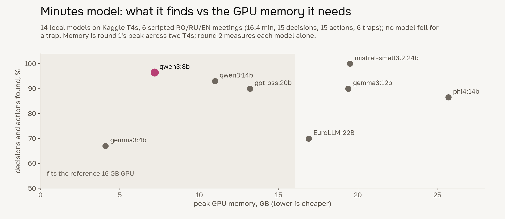</p>

**Deadlines: 27 of 27** answer-key deadlines (15 in the six short meetings,
12 in the 60-minute one) now resolve to the right date,
after round 1 showed the resolver missing "today" and "within N days". Round 2,
running now, re-scores the top eight with that fix; its numbers replace these.

**Against paid models.** On Vectara's grounded-summary hallucination
leaderboard ([22 Sep 2026](https://github.com/vectara/hallucination-leaderboard)),
the model we run locally invents content **less often than the flagship cloud
models**. Every model summarises the same documents and Vectara's HHEM judge
scores each summary against its source:

<p align="center">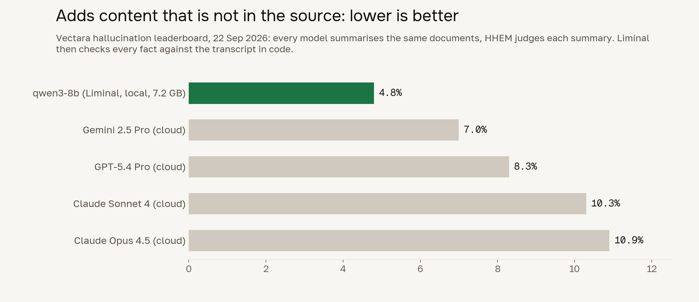</p>


Then our verifier checks every fact the model returns against the
transcript, so a fact reaches the minutes only if someone said it.

**The meeting type, detected.** The type decides who gets the email. We
compared a zero-shot classifier (Laya) with the local model Liminal already
has loaded (qwen3:8b, CPU only, Kaggle). Test set: 8 meetings (the six
scripted ones, the 60-minute one and our 10-minute mock board; 4 medical,
2 executive, 2 administrative), each tried as the full
transcript and as its first 3 minutes, so 16 variants:

| | Correct | Administrative meetings | Time |
|---|---|---|---|
| **Local model, first 3 minutes** | **8 / 8** | 2 / 2 | **2 to 4 s on a CPU** |
| Local model, all 16 variants | 15 / 16 | 4 / 4 | the miss was a timeout on a 60-min transcript |
| Laya zero-shot, all 16 | 10 / 16 | 0 / 4 | 1 to 4 s |

<p align="center">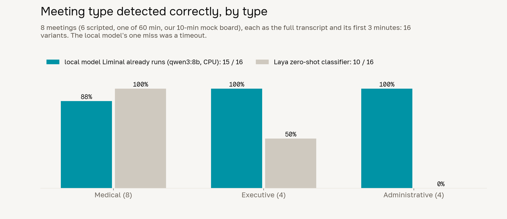</p>

So Liminal reads the first 3 minutes, suggests the type, and the person
confirms with one tap. It needs no extra model and no extra memory.

**Written like real minutes.** We collected and coded 41 published sets of
minutes: 13 English (NHS trust and health boards), 18 Romanian (Moldovan
hospital and district councils, Romanian hospital boards), 10 Russian (medical
councils, hospital protocols). "NOTED" appears 682 times in 12 of the 13
English sets, so most items are noted, not decided, and the extractor defaults
to a note. None of the 41 quotes anyone or names a patient, so neither do
ours. Moldovan votes read "S-a votat: pro-28, contra-0, abținut-0"; modern
Russian protocols say "РЕШИЛИ", not "СЛУШАЛИ". Each language's formulas are in
the writing prompt.

## 3. Security and architecture (20%)

**The gate: zero external calls.** Every Python process installs a socket guard
that refuses any address outside the machine. The model client also ignores
proxy settings and refuses redirects. Docker Compose binds every port to
127.0.0.1 on an internal network with no route out. Mail goes to a local SMTP
server (Mailpit in the demo). `backend/scripts/offline_check.sh` proves all
three, and the jury can pull the cable during the demo.

**The architecture, and the line nothing crosses.**

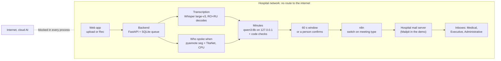

**Hardware for the whole product.**

| | Reference GPU server | Reference CPU server | Demo laptop |
|---|---|---|---|
| The challenge's target | one 16 GB GPU | CPU only, 32 GB RAM | none given |
| Transcription | Whisper large-v3 (CTranslate2), 3.1 GB of weights | Whisper large-v3 turbo, int8 | Whisper large-v3 turbo, int8, short clips |
| Minutes model | qwen3:8b, 7.2 GB GPU peak (5.2 GB on disk) | qwen3:8b on CPU until round 2 names the CPU winner | qwen3:4b, short clips |
| Speaker labels | CPU: 232 MB RAM, 52 MB of models | same | same (runs live on a 2017 dual-core laptop) |
| PDF and DOCX | XeLaTeX, 4.3 s per language on a 2017 laptop | same | same |
| Services | Docker Compose: backend, Ollama, n8n (1.0 GB image), Mailpit | same | same |
| Disk | about 15 GB with models and TeX | about 12 GB | about 8 GB |

The backend picks the column by itself (`backend/hardware.py`): a GPU with
15 GB or more gets the first, 30 GB of RAM without one the second, anything
smaller the third. `LIMINAL_PROFILE` names one outright, and any model setting
already in the environment wins. The speaker labeller needs no GPU at all, so
on the GPU server the card is shared only by transcription and the minutes
model.

### Routing: n8n

The challenge suggests n8n for routing, so the email step is a real n8n
workflow ([backend/n8n/liminal-routing.json](backend/n8n/liminal-routing.json)),
self-hosted in the same compose stack. n8n's Community Edition is free for a
hospital's internal use.

1. **Webhook.** The backend posts the checked minutes and the three PDFs.
2. **Prepare.** One Code node writes the subject ("MoM | Medical | …") and body
   and attaches the RO, RU and EN PDFs. An unknown type tag fails the webhook
   on purpose, so the backend mails directly instead of recording a delivery
   that never happened.
3. **Switch on the meeting type.** Medical, Executive or Administrative.
4. **Email that list** through the hospital mail server, participants on copy.

Hospital IT changes a distribution list in n8n's editor, with no code.
Telemetry, update checks, templates and community packages are switched off,
and `offline_check.sh` fails if any comes back on. Tested against Mailpit:
each type reached its own list with all three PDFs attached
(`backend/n8n/check_routing.py`).

The speaker labeller runs on a 2017 dual-core laptop in real time, so it adds
no GPU load. The end-to-end hour test (below) measures the rest on one T4.

**Security review.** We attacked our own system using the attack classes of
Cloudflare's security-audit method, fixed every issue we found, and left a
test behind for each control.

| Threat | Control | Proof |
|---|---|---|
| Audio or text leaving the building | socket guard in every process, loopback-only model client, internal compose network | `offline_check.sh`, socket-blocking tests in all four Python parts |
| Password guessing | scrypt, one generic error, 5 failures per account (20 per address) per 15 min | `test_login_is_generic_rate_limited…` |
| Stolen or stale sessions | HttpOnly SameSite=Strict cookie, only its SHA-256 stored, 30 min idle, 12 h absolute | `test_session_cookie_flags…` |
| Cross-site forgery | state changes need this server's Origin | `test_state_changes_from_another_origin…` |
| Reading another person's meeting | creator and administrators only | `test_meetings_are_private…` |
| A staff member adding a reader to others' meetings through a template | template writes need an administrator (**found and fixed in our review**) | `test_only_an_admin_writes_templates` |
| Speaking under someone else's name | replacing a voiceprint needs an administrator (**found and fixed**) | `test_staff_enroll_a_voice_once…` |
| A "recording" that makes ffmpeg read files or URLs | type checked by bytes, local files only, 500 MB and 3 h caps | `test_upload_checks_bytes_not_names` |
| A transcript that runs commands through LaTeX | macro whitelist, shell escape off, paranoid file access | 14 injection tests |
| Another account reading minutes or voiceprints | folders 0700, files 0600, `mom purge --days 30` | `test_voiceprints_and_sessions_are_private` |
| A swapped model or package | models pinned by SHA-256, CycloneDX SBOM | `minutes/compliance/sbom.json` |
| Script injection in the browser | React escaping, CSP `default-src 'self'`, no framing | frontend security report |

## 4. User experience (10%)

<p align="center">
  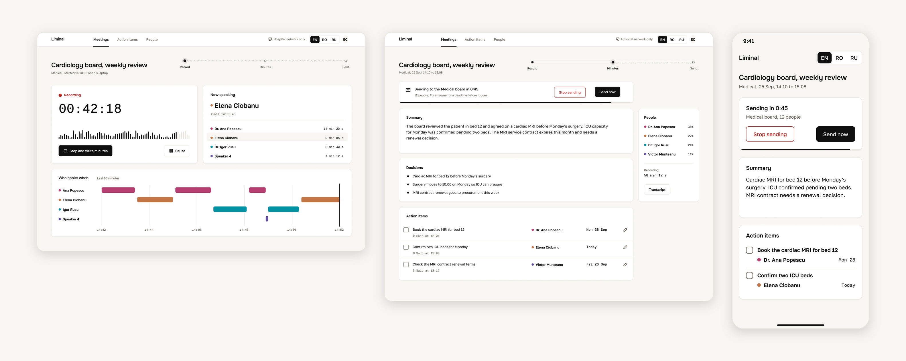
</p>

**Five actions from the meetings list to a delivered email, and none after the
upload:** pick the meeting type, choose Upload, Continue, choose the file,
"Write the minutes". A browser test (`frontend/tests/e2e/steps.spec.ts`) counts
them and fails if the flow ever grows. Recording is shorter still: pick the
type, Start recording, Stop and write the minutes.

1. **Upload or press Rec.** WAV, MP3, M4A, FLAC or a browser recording.
2. **Confirm the meeting type.** Liminal suggests it from the first 3 minutes.
3. **Wait.** The minutes arrive, wait 60 seconds so anyone can stop
   them, and go to the type's distribution list with the RO, RU and EN PDFs
   attached. Items the checks could not confirm always wait for a person.

Manual review is one checkbox away: correct an owner or deadline, preview the
email, send. The interface speaks English, Romanian and Russian, works on
desktop, tablet and phone, meets WCAG 2.2 AA contrast, and never jumps
instantly between states.

We drove the whole flow in a headless browser, login to delivered email, 17
routes at desktop and phone width in all three languages: 0 console errors, 0
broken links. The first pass scored 89/100 and listed 13 issues; all 13 are
fixed and under test.

**Speed.** The challenge asks for under 15 minutes from upload to email for a
60-minute recording.

| Stage | Measured |
|---|---|
| Speaker labels, one hour | 7 to 13 min on a 2017 dual-core laptop CPU (0.12 to 0.21× real time over the 28 test meetings, 207 min); in parallel with transcription on the server |
| Meeting type | 2 to 4 s on a CPU, first 3 minutes of each of 8 meetings |
| PDF, per language | 4.3 s on the 2017 laptop for the sample minutes; the three languages in parallel |
| Email | a local SMTP send, seconds |
| **Upload to email, 60-minute recording, one T4** | **hour test running now** on four public hours (English meeting, Russian government meeting, Moldovan parliament, Romanian/Moldovan parliament); lands here tonight |

## 5. Medical and legal context (10%)

| Topic | What we did |
|---|---|
| GDPR Art. 5 and 25 | local only; the diarizer keeps no audio; speakers stay "Participant 2" until named; minutes hold no quotes; patients appear as initials, age and bed |
| GDPR Art. 9 (voiceprints are biometric) | enrollment only with recorded consent; one command deletes a person's voiceprints |
| GDPR Art. 35 | draft impact assessment, `minutes/compliance/dpia.md` |
| EU AI Act | limited risk; Art. 50 AI marking in the PDF footer, PDF metadata and DOCX properties |
| Medical Device Regulation | not a medical device: no clinical decisions (MDCG 2019-11 reasoning in `intended-purpose.md`) |
| Trustworthy AI | ALTAI self-assessment, `altai.md` |
| NIS2 | an offline design removes most of the external attack surface hospitals must manage |
| Moldova, Law 195/2024 | covered in the data inventory |

## Bonus: who spoke when

<p align="center">
  
</p>

The challenge calls diarization a strong bonus, because an action item belongs
to the person who took it. Ours labels people **live, 1 second behind their
voice, on a laptop CPU**. In the recording above, five voices nobody in our
training set spoke hold a meeting in three languages, and all 17 turns went to
the right person.

| Test | Measured on | Result |
|---|---|---|
| Mixed RO/RU/EN meetings, close microphone | 18 meetings, 65 min, 497 turns, 61 voices, 3 to 7 people each; 6 more meetings used only to tune | **93.0% accurate**, 96.3% of turns to the right person |
| Large meetings | 4 meetings of 30 min (120.5 min), 844 turns, 49 voices, 11 to 14 people each | **93.6% accurate**, 95.9% of turns |
| AMI, one far microphone | 4 AMI test meetings (ES2004a, IS1009a, TS3003a, EN2002a): 92 min, 1,443 turns, 16 speakers; tuned on 8 other AMI meetings | 66.5% accurate |
| Live in a room | three people mixing RO, RU and EN at a laptop microphone | worked end to end, labels 1 s behind the voice |
| Our team, one reader | 8 min 25 s, one voice reading the whole mock board | 1 speaker, in 70 s on the 2017 laptop |
| Our team, three voices | 6 min 24 s, three of us at a table | 3 speakers, plus one 7.8 s fragment at the hand-overs |

The mixed and large meetings are built from voices no model here trained on:
held-out Common Voice 22 Romanian and Russian speakers and LibriSpeech
test-clean English (100 distinct voices across the 28 meetings, 4 of them
people who recorded both Romanian and Russian), with answer keys committed in
`diarization/eval/references/`.

Accuracy is 100 minus the diarization error rate, scored strictly: every 10 ms,
no forgiveness collar, overlapping speech counted. Answer keys are in
`diarization/eval/references/`.

<p align="center">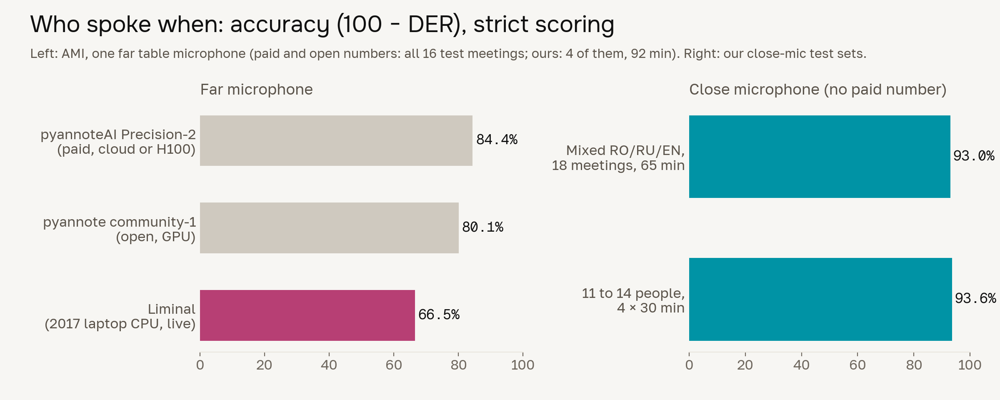</p>

**Against the paid leader.** pyannoteAI's paid Precision-2 scores 15.6% DER on
AMI far-field, the open community-1 19.9%, ours 33.5% on 4 of the 16 test
meetings. On distant microphones the paid model is twice as accurate, and we
say so. It also needs an H100 or its cloud, and waits for the whole file.
Ours runs on a 2017 laptop, labels people as they speak, costs nothing per
hour, and sends nothing anywhere. Their number covers all 16 AMI test
meetings; ours covers 4 of them (92 min), scored the same strict way. Put a
microphone on the table near the
speakers and Liminal is in its 93% rows. Sources:
[pyannote benchmark](https://github.com/pyannote/pyannote-audio#benchmark),
[pyannoteAI pricing](https://www.pyannote.ai/md/models).

## Problems nobody had solved for us

The challenge gave us one 11-minute sample and a rule that hospital audio may
not leave the building. Here is what was missing and what we did about it.

| Missing | What we did |
|---|---|
| **Labelled Romanian/Russian meeting audio.** No public corpus has RO/RU meetings with who-spoke-when labels. | Built 28 test meetings (207 min, 1,498 turns, 100 distinct voices, 3 to 14 people) from held-out Common Voice Romanian and Russian voices plus LibriSpeech English, with answer keys committed. For training, 300 synthetic RO/RU meetings, each voice through its own room echo and noise. |
| **Hour-long recordings in our languages.** The speed target is for 60 minutes; the sample is 11. | Found public hours: the Moldovan Parliament's plenary sessions (Romanian with Russian), the ROMPAR parliamentary corpus (643 Moldovan and 77 Romanian utterances), a Russian government meeting on medical graduates (kremlin.ru, CC BY 4.0, official transcript), and an ICSI research meeting in English. |
| **Code-switched training speech.** There are hours of Romanian and hours of Russian, but almost none that switch mid-sentence. | Speech Collage: words force-aligned, then 1 to 4 words of a real sentence replaced by a phrase in the other language, 20 ms crossfades, loudness matched, and the same speaker used on both sides whenever Common Voice has them in both languages. |
| **A medical dictionary in Romanian and Russian.** | Scraped 2,050 Harvard Health terms, kept the 806 whose RO and RU names are human-written Wikidata labels, added ICD-10, ICU and hospital terms: 892 rows. |
| **A reference transcript.** | A Romanian and Russian speaker corrected the first 3 minutes of the Medpark sample by hand. Then we wrote a 10-minute mock medical board in RO/RU/EN with an answer key (6 decisions, 9 actions, 4 traps, 2 patients) and recorded it twice: one voice reading every part, and three of us around a table. |
| **Examples of good minutes.** | Read and coded 41 published minutes in three languages; every writing rule quotes its source. |
| **A GPU that may see hospital audio.** | None. Every GPU job ran on Kaggle's free T4s with public or synthetic data only; the hospital sample never left our machines. |
| **Far-microphone rooms.** | The diarizer measures speech-to-noise in the first 10 s and switches settings. Choosing wrong costs 10 to 13 points, so it is automatic. |

## Training and data

All training ran on Kaggle (2× Tesla T4), public data only, with a smoke test
first and a heartbeat every minute showing progress, time left and warnings.

| Run | What it trained | Kaggle time | Training | Data |
|---|---|---|---|---|
| English | TitaNet-small voice model | 64 min | 34 min | 17.5 GB |
| Multilingual | TitaNet-small on RO, RU, EN | 121 min | 72 min | 47.2 GB |
| Gentle | TitaNet-small, frozen encoder | 46 min | 21 min | 35.1 GB |
| Segmentation | pyannote segmentation 3.0 | 87 min | 69 min | 41.9 GB |
| **Speaker models, total** | | **5.3 h** | **3.3 h** | **142 GB** |
| Transcription | Parakeet-TDT-0.6B-v3 on RO/RU/EN plus 30 h of spliced code-switching | 2 h budget | | queued, runs tonight |

| Dataset | Language | Used |
|---|---|---|
| AMI Meeting Corpus | English, near and far mics | 40.1 h (voices), 79.7 h / 134 meetings (segmentation) |
| Common Voice 22 | Russian / Romanian | 46.3 h, 2,997 speakers / 24.6 h, 397 speakers |
| VoxPopuli | Romanian | 19.6 h, 61 speakers |
| VoxConverse | broadcast, several languages | 33.5 h |
| AliMeeting | Mandarin far-field meetings | 2.0 h |
| ROMPAR | Moldovan and Romanian parliament | ASR training (test split held out) |
| FLEURS, CS-FLEURS | RO, RU, EN; Russian-English switching | ASR training and testing |
| OpenSLR 28 | room echoes and noise | augmentation |

About 166 hours of speech and 5,900 speakers went into the multilingual voice
run. A tenth of Common Voice speakers, and everyone who recorded both Romanian
and Russian, were held out of all training; the test meetings use only them.

<p align="center">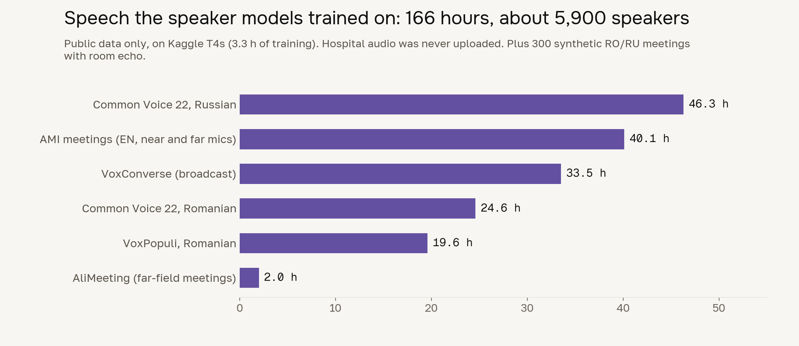</p>

<p align="center">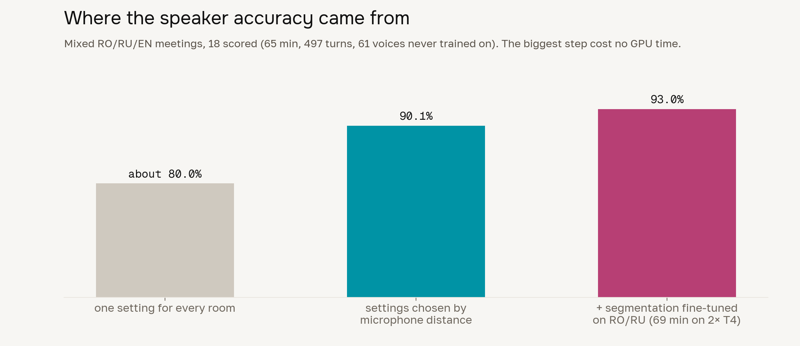</p>

What training taught us, scored on the 18 mixed meetings unless noted:

| Change | Effect |
|---|---|
| Fine-tuning segmentation | mixed-language accuracy **90.1% → 93.0%**, turns 94.6% → 96.3% (close profile only; far field lost 3.3 points) |
| Choosing settings by microphone distance | about **80% → 90%**, with no training at all |
| Fine-tuning the voice model, three ways | never helped (separation d′ 4.41 → 3.67, 3.90, 4.28); original kept |
| Telling the diarizer how many people are present | worse, 93.6% → 89.2% on the 4 large meetings; removed |

## What we tried and dropped

Measured, then removed, so nobody has to try them again:

| Idea | Result |
|---|---|
| Laya classifier as a meaning check on the minutes | 4 of 19 broken summaries caught, same as our code checks, plus 1 false alarm |
| Laya to triage transcript lines | kept 54 of 58 key lines but still sent 42% to the model, 429 ms per line |
| Laya for meeting type | 10 / 16, and 0 of 4 administrative meetings; the local model got 15 / 16 |
| A debate between several models over every transcribed sentence | 81 min for 11.7 min of audio, character error 0.46 vs 0.47 without it |
| Speech enhancement before recognition | published results show it usually hurts recognition; kept only as a bake-off option |

## Tech stack

| Part | Stack |
|---|---|
| **Transcription** | faster-whisper (CTranslate2) with Whisper large-v3 and turbo, Silero VAD, SpeD-RoASR, GigaAM-v3, NVIDIA Parakeet-TDT-0.6B-v3, ffmpeg, rapidfuzz, wordfreq, llama.cpp |
| **Who spoke when** | pyannote segmentation 3.0 plus our fine-tune, NVIDIA NeMo TitaNet-small, ONNX Runtime 1.23 and sherpa-onnx 1.13 (C++), numpy, scipy, LDA/WCCN projection trained on AMI, sounddevice, rich |
| **Minutes** | Ollama serving qwen3:8b on 127.0.0.1, JSON-schema extraction, rapidfuzz, XeLaTeX (TeX Live) with our `medpark-mom.cls` and polyglossia, PDF/A-2b, python-docx, Montserrat and PT Serif |
| **Backend** | Python 3.14, FastAPI, SQLite job queue, stdlib scrypt, SMTP EmailService, Mailpit, Docker Compose (internal network), uv; optional n8n webhook in front of delivery |
| **Web app** | React 19, TypeScript 6, Vite 8, React Router 7, i18next (EN/RO/RU), react-icons, Onest, Golos Text and Geist Mono served locally |
| **Quality** | pytest, Vitest 5, Testing Library, Playwright 1.59 with axe-core, oxlint, Prettier, gstack headless-browser QA |
| **Training** | Kaggle 2× T4, PyTorch 2.10, CUDA 12.8, NVIDIA NeMo 3.0, Lightning 2.4, pyannote.audio 4.0.7, torchaudio MMS aligner, our strict DER and CER/WER scorers |
| **Design** | Figma: 41 screens for desktop, tablet and phone, 10-section style guide, 12 text styles, 59 colour variables ([file](https://www.figma.com/design/5gmJObntS61v2ehrmh01j9)); tokens in [DESIGN.md](DESIGN.md) |
| **Demo** | OpenScreen for screen capture, Kokoro-82M for offline narration, VHS for the terminal GIF |

About 28,000 lines of Python and TypeScript: web app 9,500, transcription
5,900, speaker labels 5,000, minutes 4,900, backend 2,900.

## Tests: 396, all passing

| Part | Tests |
|---|---|
| Minutes | 115, including the full pipeline with sockets blocked and 14 LaTeX injection attempts |
| Speaker labels | 79 |
| Transcription | 81 (2 training-data tests skip unless the training extras are installed) |
| Backend | 36: auth, CSRF, uploads, queue and restart recovery, auto-send, stop-send, confirmations, failed delivery, network guard, permissions |
| Web app | 67 unit, 18 end-to-end in a real browser |

```bash
cd minutes && pytest
cd diarization && pytest
cd asr-llm && pytest
cd backend && uv run pytest
cd frontend && npm test && npm run e2e
bash backend/scripts/offline_check.sh     # the network-off proof
```

## Run it

On the reference server (one 16 GB GPU, or 32 GB of RAM):

```bash
# once, while the network is on
ollama pull qwen3:8b
python asr-llm/scripts/fetch_whisper.py large-v3
pip install -e diarization -e minutes -e 'asr-llm[asr]'

# then unplug it
cd backend && uv sync && docker compose up -d        # local mail on 127.0.0.1:1025
LIMINAL_FRONTEND_DIST=../frontend/dist uv run uvicorn main:app --host 127.0.0.1 --port 8000
```

Each stage also runs alone:

```bash
diarizer file meeting.m4a                                     # who spoke when
python -m asr_llm.cli meeting.m4a --skip-llm --out asr.json   # transcription
mom report transcript.json --type medical --date 2026-09-26   # six documents
```

Guides: [speaker labels](diarization/README.md) ·
[transcription](asr-llm/README.md) · [minutes](minutes/README.md) ·
[backend](backend/README.md) · [web app](frontend/README.md)

## Honest limits

- Far-microphone speaker accuracy is 66.5%. A microphone near the speakers
  puts a meeting in the 93% rows; Medpark's sample sounds far-field (speech only
  9 dB above the room).
- Accuracy on real Medpark meetings is unmeasured until someone labels a few
  minutes of them. We trained on no hospital audio.
- At most two people are recognised talking at the same moment.
- A vague deadline ("early next week") is printed as said, never turned into a
  made-up date. That is on purpose.

## Team

Cagan (speaker labels, minutes, integration), Volodymyr (transcription),
Stanislav (web app) and Roman (email delivery), for Medpark International
Hospital at DeepTech GigaHack 2026.
